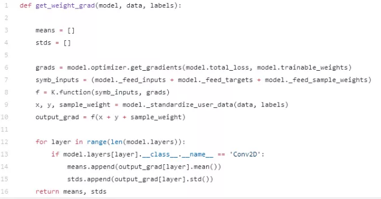
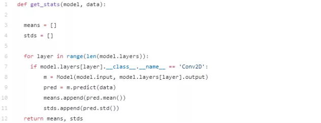

```python
#keras学习率调整策略
keras.callbacks.ReduceLROnPlateau(monitor='val_loss', factor=0.1, patience=10, verbose=0, mode='auto', epsilon=0.0001, cooldown=0, min_lr=0)
#使用方法如下：
reduce_lr = ReduceLROnPlateau(monitor='val_loss', patience=10, mode='auto')
model.fit(train_x, train_y, batch_size=32, epochs=300, validation_split=0.1, callbacks=[reduce_lr])
```

```python
#实例化一个生成器
#数据增强:读取图像文件，将jpg文件解码为RGB像素网格，将像素网格转化为浮点数张量，将像素值归一化到[0-1]之间。
datagen = ImageDataGenerator(rescale=1./255)  
#训练集的生成器
train_gen = datagen.flow()
datagen.flow_from_dataframe()
datagen.flow_from_directory()
#训练
model.compile()
model.fit_generator()
#评估 输入数据和标签，输出损失和精确度
loss, accuracy = model.evaluate(x_test, y_test)
#测试 输入测试数据，输出预测结果
y_pred = model.predict(x_test)
#模型反馈
keras.callbacks.History  #记录每一次epoch训练的结果，结果包含loss以及acc的值
keras.callbacks.ModelCheckpoint  #在每个epoch后保存模型
keras.callbasks.EarlyStopping  #早停，当被检测的值不再提升时，则停止训练
#权重的保存与恢复
model.save_weights("model_weights.h5")
model.load_weights("model_weights.h5")
#整个模型的保存与恢复
model.save("model.h5")
model = tf.keras.models.load_model("model.h5")
```


#### keras初始化

```python
keras.layers.Conv1D(filters, kernel_size, strides=1, padding='valid', data_format='channels_last', dilation_rate=1, activation=None, use_bias=True, kernel_initializer='glorot_uniform', bias_initializer='zeros', kernel_regularizer=None, bias_regularizer=None, activity_regularizer=None, kernel_constraint=None, bias_constraint=None)
#在keras中，卷积层默认是以Glorot Uniform进行初始化的，使用此初始化方法可能学不到任何东西。可以将初始化方法换成Kaiming Uniform 分布he_uniform。
```

当训练的过程中没有学到东西时，可以检查每层的梯度和激活值。





