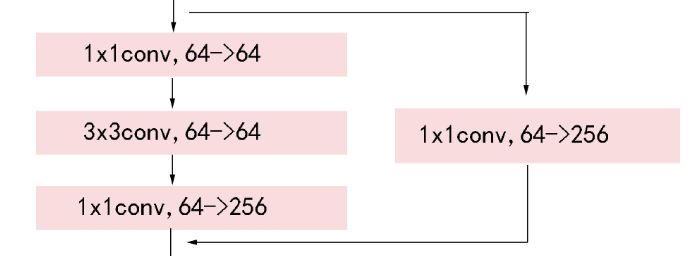

#### pytorch常用知识点

```python
torch.randperm(n)  #返回[0,n-1]的数组
torch.max(tensor)  # 返回tensor中的最大元素
torch.max(tensor, 0)  # 返回每列的最大元素及其索引
torch.max(tensor, 1)  # 返回每行的最大元素及其索引
torch.sum(tensor, 0)  # 按列求和
torch.sum(tensor, 1)  # 按行求和
# pytorch中为cpu和gpu设置随机数种子
torch.manual_seed(seed)
torch.cuda.manual_seed(seed)
```

```python
#pytorch学习率调整策略
torch.optim.lr_scheduler.ReduceLROnPlateau(optimizer, mode='min', factor=0.1, patience=10, verbose=False, threshold=0.0001, threshold_mode='rel', cooldown=0, min_lr=0, eps=1e-08)
# mode 表示当监控量不再下降时减小学习率
# factor 每次学习率减小的比率
# patience 容忍网络性能不提升的次数，高于此次数即减小学习率

#使用方法如下：
optimizer = torch.optim.SGD(model.parameters(), lr=0.01) 
scheduler = ReduceLROnPlateau(optimizer, 'min',factor=0.5, patience=4, verbose=True)
scheduler.step(val_loss)
```

```python
#pytorch中需要定义自己的数据类，继承于torch.utils.data.Dataset，需要实现__len__,__getitem__两个函数。
# pytorch中使用torch.utils.data.DataLoader来定义迭代器，按照batch_size将数据封装成tensor作为模型的输入。 
from torch.utils.data import Dataset, DataLoader

# pytorch中的数据预处理与增强使用torchvision.transforms
from torchvision import transforms
transforms.ToTensor()  #将PIL Image或ndarray转化为tensor，并归一化到[0-1]
transforms.Normalize()  #标准化

# pytorh参数的保存与加载
torch.save(model.state_dict(), "model.pth")
model.load_state_dict(torch.load("model.pth"))

# 对于在训练阶段和测试阶段的Batch Normalization和Dropout的不同，pytorh中使用model.train()和model.eval()进行区分。
```

```python
tensor.item()  # 若tensor只有一个元素，则调用item会将tensor转化为python中的标量，若tensor不止一个元素，则会出错。
with torch.no_grad()  # 此范围内的代码，将不会进行反向传播，降低了内存使用并加速计算
model.modules # 作为迭代器时，会遍历model中所有的子层
```


##### 多GPU训练

使用多个GPU训练时，训练命令前需要加上：

```python
python -m torch.distributed.launch --nproc_per_node=gpu个数 ...
```

判断能使用的GPU个数：

```python 
num_gpus = int(os.environ["WORLD_SIZE"]) if "WORLD_SIZE" in os.environ else 1
```

##### model参数

pytorch中的参数分为两种，一种是module中的参数，即nn.Parameter，另一种是buffer，每次执行optim.step时，前者会得到更新，后者不会更新。

```python
self.register_buffer   #可以注册buffer参数。
```

##### 固定参数requires_grad=False

```python
def _freeze_backbone(self, freeze_at):
    for stage_index in range(freeze_at):
        if stage_index == 0:
            m = self.stem  # stage 0 is the stem
        else:
            m = getattr(self, "layer" + str(stage_index))
        for p in m.parameters():
            p.requires_grad = False
```

##### 权重初始化

```python
for l in [self.conv1, self.conv3,]:
    nn.init.kaiming_uniform_(l.weight, a=1)
```

##### 残差网络



```python
def forward(self, x):
    identity = x

    out = self.conv1(x)
    out = self.bn1(out)
    out = F.relu_(out)

    out = self.conv2(out)
    out = self.bn2(out)
    out = F.relu_(out)

    out = self.conv3(out)
    out = self.bn3(out)

    if self.downsample is not None:
        identity = self.downsample(x)

    out += identity
    out = F.relu_(out)

    return out
```

##### 上采样

```python
torch.nn.functional.interpolate()
```


#### PyTorch-OpCounter工具

GitHub 地址：[https://github.com/Lyken17/pytorch-OpCounter](https://github.com/Lyken17/pytorch-OpCounter)

可用于统计模型的参数量和计算量。例子如下：

```python
from torchvision.models import resnet50
from thop import profile

model = resnet50()
input = torch.randn(1, 3, 224, 224)
flops, params = profile(model, inputs=(input, ))
```


#### yacs配置文件

可与yaml文件配合使用。

```python 
from yacs.config import CfgNode as CN

#创建一个配置节点_C
-C = CN()

#在_C下创建新的配置节点_C.SYSTEM
#给_C.SYSTEM的属性配置默认值
_C.SYSTEM = CN()
_C.SYSTEM.NUM_GPUS = 8

cfg.merge_from_file()  #更新配置文件
```


#### 日志logger

```python
def setup_logger(name, save_dir, filename="log.txt"):
    logger = logging.getLogger(name)  #初始化日志对象
    logger.setLevel(logging.DEBUG)  #设置日志等级，低于此等级的日志将不会显示

    #将日志信息按格式输出到屏幕终端
    ch = logging.StreamHandler(stream=sys.stdout)
    ch.setLevel(logging.DEBUG)
    formatter = logging.Formatter("%(asctime)s %(name)s %(levelname)s: %(message)s")
    ch.setFormatter(formatter)
    logger.addHandler(ch)

    #将日志信息保存到文件中
    if save_dir:
        fh = logging.FileHandler(os.path.join(save_dir, filename))
        fh.setLevel(logging.DEBUG)
        fh.setFormatter(formatter)
        logger.addHandler(fh)

    return logger
```


#### 优化器optimizer

bias的学习率一般为weights的两倍。

```python
def make_optimizer(cfg, model):
    params = []
    for key, value in model.named_parameters():
        if not value.requires_grad:
            continue
        lr = cfg.SOLVER.BASE_LR
        weight_decay = cfg.SOLVER.WEIGHT_DECAY
        if "bias" in key:
            lr = cfg.SOLVER.BASE_LR * cfg.SOLVER.BIAS_LR_FACTOR
            weight_decay = cfg.SOLVER.WEIGHT_DECAY_BIAS
        params += [{"params": [value], "lr": lr, "weight_decay": weight_decay}]

    optimizer = torch.optim.SGD(params, lr, momentum=cfg.SOLVER.MOMENTUM)
    return optimizer
```


#### 混合精度训练

大多数的深度学习模型使用的是32位单精度浮点数（FP32）来进行训练，而混合精度训练的方法则通过16位浮点数（FP16）进行深度学习模型训练，从而减少了训练深度学习模型所需的内存，同时由于FP16的运算比FP32运算更快，从而也进一步提高了硬件效率。

使用此方法可以使用更大的batch_size。

```python
from apex import amp
model, optimizer = amp.initialize(model, optimizer)

with amp.scale_loss(losses, optimizer) as scaled_losses:
    scaled_losses.backward()
```

也可以使用half()函数进行转换。


