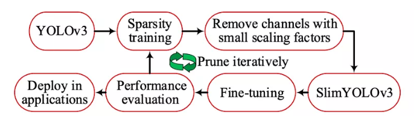

在轻量级网络中，组卷积和深度卷积起到了关键性作用。

- 组卷积 Group Convolution：
  将feature map拆分成几组，分别进行卷积，最后再将卷积结果的feature map 合并. 最早在AlexNet中出现。因为当时GPU内存有限，逼迫将feature map拆分到两个GPU上分别卷积再融合。

- 深度卷积 Depth-wise convolution：
  对每一个通道进行各自的卷积，输出相同的通道数，再用进行跨通道的标准1*1卷积来融合信息。 

  

#### 轻量级分类网络

- MobileNetV1
- MobileNetV2
- MobileNetV3
- MixNet  -- 使用AutoML框架自动搜索得到。混叠多个尺寸的卷积核到同一个卷积中。

#### 目标检测网络

##### SlimYOLOv3

GitHub 地址：[https://github.com/PengyiZhang/SlimYOLOv3](https://github.com/PengyiZhang/SlimYOLOv3)

一种对YOLOv3进行剪枝的网络，大幅减少了参数量、占用内存、推断时间。可用于无人机。

剪枝的方法如下：

YOLOv3经过稀疏训练，得到各通道的尺度因子，然后去除那些尺度因子小的通道，将剪枝得到的模型SlimYOLOv3在数据集上进一步微调，得到检测结果，然后进入下一轮的稀疏训练。以上剪枝过程是迭代重复的，直到满足一定的模型条件，比如模型剪枝率达到一定要求。

##### YOLOv3-model-pruning

GitHub 地址：[https://github.com/Lam1360/YOLOv3-model-pruning](https://github.com/Lam1360/YOLOv3-model-pruning)