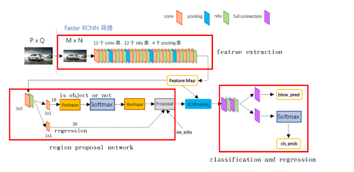
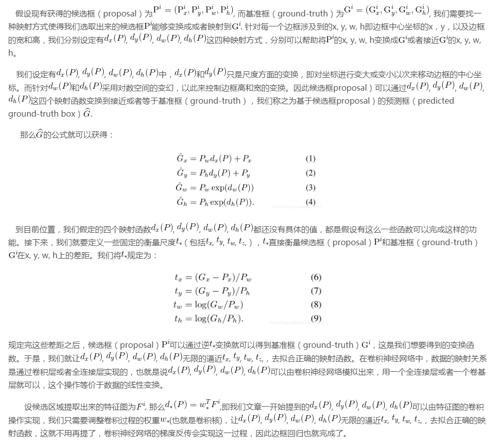

卷积核输出大小的计算公式：

- 输入图片大小 W×W

- Filter大小 F×F

- 步长 S

- padding的像素数 p

  N = (W − F + 2P )/S+1       padding  = 'valid'

##### faster rcnn中的anchor

对于事先设置好的三种不同的面积大小和长宽比，可以生成九种anchors。

对于stage_4产生的特征图，将此特征图中的每个像素点映射回原图，会得到一定大小的区域，然后再此区域中可以生成九个不同的anchors，这样此特征图总共会产生(w×h×9)个anchors，通过设置阈值，将与真实框iou最大的anchor标记为正样本，将anchor与真实框的iou大于0.7的标记为正样本，将iou小于0.3的标记为负样本，其余的不参与训练。

rpn深层的anchors需要找到与之对应的在原图中的基准边框。将anchor与基准边框的iou小于某个阈值的anchor设置为背景，大于某个阈值设置为含有目标的前景。使得训练的正负样本的比例为1：1。

通过rpn得到一系列的预测边框后，需要进行进一步的筛选，去掉iou介于两种阈值之间的边框，将候选边框映射到特征图，然后使用roi pooling池化为大小一致的边框。

loss为两阶段总的loss。

faster-rcnn的网络结构图：

边框回归的解释：

